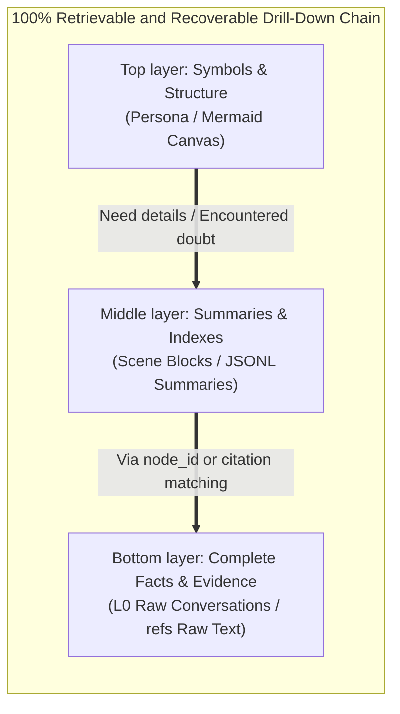
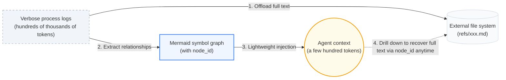

<div align="center">


### Help your Agent accumulate experience, so people can focus on creation.

[](https://www.npmjs.com/package/@tencentdb-agent-memory/memory-tencentdb)
[](./LICENSE)
[](https://nodejs.org/)
[](https://github.com/openclaw/openclaw)

[](https://discord.gg/kDtHb5RW2)

[Highlights](#-highlights) · [Overview](#overview) · [Core Technology](#core-technology-reject-flat-storage-embrace-layering-and-symbolization) · [Quick Start](#quick-start)

</div>

---

## ✨ Highlights

> **TencentDB Agent Memory = Symbolic short-term memory + Layered long-term memory.**
>
> - **Symbolic short-term memory**: offload heavy tool logs layer by layer and progressively condense them into lightweight Mermaid structural symbols, drastically reducing token consumption while improving task success rate.
> - **Layered long-term memory**: refine fragmented conversations layer by layer into structured personas and scenes — no more flat vector piles.

**Plugged into OpenClaw**, it saves up to **61.38% tokens**, lifts pass rate by **+51.52%** (relative), and pushes PersonaMem accuracy from **48%** to **76%**.

| Memory Capability | Benchmark | Openclaw Success | With Plugin | Relative Δ | Openclaw Tokens | With Plugin Tokens | Relative Δ |
| :--- | :--- | :---: | :---: | :---: | :---: | :---: | :---: |
| **Short-term** | WideSearch | 33% | **50%** | **+51.52%** | 221.31M | **85.64M** | **−61.38%** |
| **Short-term** | SWE-bench | 58.4% | **64.2%** | **+9.93%** | 3474.1M | **2375.4M** | **−33.09%** |
| **Short-term** | AA-LCR | 44.0% | **47.5%** | **+7.95%** | 112.0M | **77.3M** | **−30.98%** |
| **Long-term** | PersonaMem | 48% | **76%** | **+59%** | — | — | — |

> These are long-session evaluations, not single-turn isolated runs. Multiple tasks are concatenated into the same session and executed back-to-back. For example, each SWE-bench session runs 50 tasks consecutively to simulate the context-accumulation pressure faced by a real long-horizon Agent.

---

## Overview

**Memory is not about letting AI store everything — it is about freeing humans from repeating everything.**

In real work, we often have to repeatedly tell the Agent about fixed SOPs, project backgrounds, tool habits, and output formats. This information should not need to be re-explained every time, yet it also should not be mindlessly and flatly crammed into the context.

TencentDB Agent Memory helps the Agent learn your workflows, retain task context, and reuse past experience. But we **reject brute-force history piling** and **abandon irreversible brute-force summarization**. We design memory as a deeply layered system: **symbolic memory** to solve information overload within a single long task, and **memory layering** to solve cross-session experience accumulation.

> **Let the Agent remember what should be remembered, so people can focus on judgment, creation, and work that truly matters.**

---

## Core Technology: Reject Flat Storage, Embrace Layering and Symbolization

The design philosophy of TencentDB Agent Memory revolves around two cores: **memory layering** and **symbolic memory**. This not only lets the Agent "remember more" but, more importantly, "think more clearly".

### 1. Memory Layering: Progressive Disclosure and Heterogeneous Storage

Traditional memory systems often slice all data into flat vectors. Recall then feels like searching for clues among a pile of unrelated sticky notes, lacking the guidance of a macro perspective.

We believe that **whether it is long-term knowledge, short-term tasks, or future experiential capabilities, memory should never be flat — both generation and recall must have layers**. TencentDB Agent Memory adopts "layering" as the unified design philosophy across the entire architecture:

*   **Short-term memory (context offload / task) layering**: the bottom layer retains the raw, heavy tool-call results (`refs/*.md`); the middle layer extracts step summaries (`jsonl`); the top layer condenses everything into an extremely lightweight Mermaid task canvas. The Agent only needs to focus on the top-layer structure in the context, drilling down to the bottom layer via `node_id` when errors occur.
*   **Long-term personalization (user understanding) layering**: break away from flat history logs and build a semantic pyramid: L0 raw conversations → L1 structured facts → L2 scene blocks → L3 user persona. Rely on the top-layer persona to grasp user preferences day-to-day; search the bottom-layer facts when details need verification.
*   **Skill generation (skill and action accumulation, Roadmap) layering**: memory should not be limited to "knowing what" but also include "knowing how". We are extending layering into the action domain: from bottom-layer execution traces and error logs, the middle layer generalizes common solution patterns, and the top layer ultimately distills reusable Skills or standardized SOP code.

<p align="center">
  
</p>

**Progressive disclosure and heterogeneous storage**: to support this pervasive layering, we designed a storage approach combining a bottom-layer database with a top-layer file system. The bottom layer (massive facts, logs, traces) is stored in databases or archive files, ensuring stability and full-text retrieval; the top layer (personas, scenes, canvases, Skills) is stored in business-readable file systems (Markdown), ensuring high information density, clear logic, and white-box tunability. **Lower layers preserve evidence; upper layers preserve structure.**

**Every piece of information is 100% retrievable and recoverable**: the biggest risk of compression or abstraction is "losing the evidence". Thanks to strict index mapping, no summary in the system is an "irreversible" black box. Whether it is an error log offloaded from short-term memory or a user preference distilled from long-term memory, the Agent or developer can perfectly trace and recover it along the chain: "top-layer symbol (persona / canvas) → middle-layer index (scene / JSONL) → bottom-layer raw text (L0 conversation / refs)".



### 2. Symbolic Memory: Express Maximum Semantics with Minimum Symbols (Mermaid Canvas)

In long tasks, the biggest token consumers are often verbose process logs (e.g., search results, code, error messages). To address this, we combine **Context Offloading** to propose **Symbolic Memory**:

*   **Mermaid symbol graph**: replacing verbose natural language or flat JSON, we use high-density, strongly-topological Mermaid syntax to depict task state transitions, precisely understandable by LLMs and easy for humans to read.
*   **History folding and offloading**: complete tool logs are offloaded to the external file system; the context retains only a lightweight Mermaid task map.
*   **`node_id`-based tracing**: the Agent reasons by looking at the symbol graph; when it needs to verify details, it simply greps the `node_id` on the graph to instantly retrieve the full original text — drastically reducing costs while preserving 100% traceability.



---

## Quick Start

### 1. Install the plugin

```bash
openclaw plugins install @tencentdb-agent-memory/memory-tencentdb
openclaw gateway restart
```

### 2. Zero-config to enable

Defaults to a local `SQLite + sqlite-vec` backend.

```jsonc
// ~/.openclaw/openclaw.json
{
  "memory-tencentdb": {
    "enabled": true
  }
}
```

Once enabled, TencentDB Agent Memory automatically handles conversation capture, memory extraction, scene aggregation, persona generation, and recall before the next turn.

### 3. Use the TCVDB backend (optional, requires version ≥ 0.2.0)

```jsonc
{
  "memory-tencentdb": {
    "storeBackend": "tcvdb",
    "tcvdb": {
      "url": "http://your-vdb-instance:8100",
      "apiKey": "your-api-key",
      "database": "my_memory_db"
    }
  }
}
```

### 4. Enable short-term compression (optional, requires version ≥ 0.3.0)

```jsonc
{
  "memory-tencentdb": {
    "offload": {
      "enabled": true
    }
  }
}
```

### 5. Hermes Gateway Quick Start (Docker, requires version ≥ 0.3.0)

In addition to OpenClaw, this plugin also supports the [Hermes](https://github.com/hermes-ai/hermes) Agent. Start a memory-enabled Hermes with a single command:

```bash
docker run -d \
  --name hermes-memory \
  --restart unless-stopped \
  -p 8420:8420 \
  -e MODEL_API_KEY="your-api-key" \
  -e MODEL_BASE_URL="https://api.lkeap.cloud.tencent.com/v1" \
  -e MODEL_NAME="deepseek-v3.2" \
  -e MODEL_PROVIDER="custom" \
  -v hermes_data:/opt/data \
  agentmemory/hermes-memory:latest
```

The image supports `linux/amd64` and `linux/arm64`. It ships with Tencent Cloud DeepSeek-V3.2 defaults — to use a different model, pass `MODEL_BASE_URL`, `MODEL_NAME`, and `MODEL_PROVIDER` accordingly.

Verify:

```bash
curl http://localhost:8420/health          # Check Gateway health
docker exec -it hermes-memory hermes       # Enter Hermes conversation
```

---

## 🔧 Configurable Parameters

**Every field has a sensible default — it runs with zero configuration.** When you want to tune, peel back the layers based on how deep you go.

<details>
<summary><b>🟢 Level 1 · Daily tuning</b> (covers 90% of use cases)</summary>

| Field | Default | Description |
| :--- | :--- | :--- |
| `storeBackend` | `"sqlite"` | Storage backend: `sqlite` / `tcvdb` |
| `recall.strategy` | `"hybrid"` | Recall strategy: `keyword` / `embedding` / `hybrid` (RRF fusion, recommended) |
| `recall.maxResults` | `5` | Number of items returned per recall |
| `pipeline.everyNConversations` | `5` | Trigger an L1 memory extraction every N turns |
| `extraction.maxMemoriesPerSession` | `20` | Max memories extracted per L1 pass |
| `persona.triggerEveryN` | `50` | Generate the user persona every N new memories |
| `offload.enabled` | `false` | Whether to enable short-term compression |

</details>

<details>
<summary><b>🟡 Level 2 · Advanced tuning</b> (long task / long session)</summary>

| Field | Default | Description |
| :--- | :--- | :--- |
| `pipeline.enableWarmup` | `true` | Warm-up: a new session triggers from turn 1, doubling each time up to N (1→2→4→…) |
| `pipeline.l1IdleTimeoutSeconds` | `600` | Trigger L1 after the user has been idle for this many seconds |
| `pipeline.l2MinIntervalSeconds` | `900` | Minimum interval between two L2 passes within the same session |
| `recall.timeoutMs` | `5000` | Recall timeout; on timeout, skip injection without blocking the conversation |
| `extraction.enableDedup` | `true` | L1 vector dedup / conflict detection |
| `capture.excludeAgents` | `[]` | Glob patterns to exclude specific agents (e.g. `bench-judge-*`) |
| `capture.l0l1RetentionDays` | `0` | Local retention days for L0 / L1 files; `0` = never clean up |
| `offload.mildOffloadRatio` | `0.5` | Mild compression trigger ratio (of context window) |
| `offload.aggressiveCompressRatio` | `0.85` | Aggressive compression trigger ratio |
| `offload.mmdMaxTokenRatio` | `0.2` | Token budget ratio for MMD injection |
| `bm25.language` | `"zh"` | Tokenizer language: `zh` (jieba) / `en` |

</details>

<details>
<summary><b>🔴 Level 3 · Full parameter reference</b> (ops / custom models / remote embedding)</summary>

For all fields, types, and constraints see [`openclaw.plugin.json`](./openclaw.plugin.json) and [`CONFIGURATION.md`](./CONFIGURATION.md).

- `embedding.*` — remote embedding service (OpenAI-compatible API)
- `tcvdb.*` — full Tencent Cloud Vector Database parameters (incl. HTTPS / self-signed CA)
- `llm.*` — standalone LLM mode (bypass OpenClaw's built-in model and run L1/L2/L3 with a designated API)
- `offload.backendUrl / backendApiKey` — offload the L1/L1.5/L2/L4 flow to a backend service
- `report.*` — metrics reporting

</details>

---

## 🤔 Design Highlights

### 1. Macro persona + micro facts: one drill-down mechanism to reduce hallucination

The biggest risk of compression is "saving tokens but losing the receipts". So TencentDB Agent Memory does not collapse history into an irreversible summary — it keeps a clear path from high-level abstraction back to ground-truth evidence.

| Question type | First look at | Drill down to |
| :--- | :--- | :--- |
| Daily preferences, voice, long-term goals | L3 Persona / L2 Scene | Hit L1 / L0 when facts are needed |
| Specific facts, dates, project details | L1 Memory / L0 Conversation | Widen the time range or use semantic recall when hits are sparse |
| Continuing a long-running task | Active MMD task canvas | Check the JSONL when the summary is thin, then read `refs/*.md` for raw text |
| Resuming a historical task | Metadata task entry | Open the MMD → find `node_id` → trace `result_ref` |

The upper layer carries "judgment" and direction; the lower layer carries "evidence" and precision. Short-term compression and long-term memory close into one loop: **foldable and unfoldable; abstract yet auditable.**

### 2. White-box debuggable: memory is not a black-box vector

Many memory systems break here: when recall is wrong, all you see is a list of vector scores, and you cannot tell where things went sideways. TencentDB Agent Memory keeps the key intermediates as readable files:

- L2 scene blocks are Markdown — open and inspect directly.
- L3 personas live in `persona.md` and trace back to the scenes that produced them.
- Short-term task canvases are Mermaid — readable to humans and to Agents.
- Raw payloads, summaries, and nodes are linked by `result_ref` and `node_id`.

Debugging is no longer rummaging through a black-box database — it is walking the chain "persona → scene → memory → raw text" until the issue surfaces.

### 3. Production-ready engineering: a real plugin, not a demo

| Capability | Description |
| :--- | :--- |
| OpenClaw plugin | Capture, extract, and recall memory automatically once installed |
| Hermes Gateway adapter | `TdaiCore + HostAdapter` decoupled from the host framework |
| Dual backends | Local `SQLite + sqlite-vec`, or remote `TCVDB` |
| Hybrid retrieval | BM25 + vector + RRF — both keyword and semantic recall |
| Agent tools | `tdai_memory_search` / `tdai_conversation_search` |
| Data migration | Historical import, SQLite → TCVDB migration, VDB export |

---

## Documentation

| Document | Contents |
| :--- | :--- |
| [`CONFIGURATION.md`](./CONFIGURATION.md) | Full configuration reference, field descriptions, and advanced parameters |
| [`scripts/README.memory-tencentdb-ctl.md`](./scripts/README.memory-tencentdb-ctl.md) | Operations & management tooling |
| [`CHANGELOG.md`](./CHANGELOG.md) | Release notes and version history |
| [`openclaw.plugin.json`](./openclaw.plugin.json) | OpenClaw plugin manifest and configuration schema |

---

## Community & Contributing

We welcome every kind of contribution — bug reports, feature ideas, doc fixes, benchmark reproductions, ecosystem integrations, or a Pull Request. Agent memory is far from a solved problem, and we'd love to figure it out together.

- 🐞 **Found a bug or have a question?** Open an issue at [GitHub Issues](https://github.com/Tencent/TencentDB-Agent-Memory/issues) — we respond within 24 hours.
- 💡 **Have an idea to share?** Start a thread in [GitHub Discussions](https://github.com/Tencent/TencentDB-Agent-Memory/discussions).
- 🛠️ **Want to contribute code?** Please read [CONTRIBUTING.md](./CONTRIBUTING.md) first.
- 💬 **Want to chat with us?** Join our [Discord community](https://discord.gg/kDtHb5RW2) and talk to the early developers directly.

---

## Roadmap

- [x] Long-term personalized memory (L0 → L3)
- [x] Short-term context compression (Context Offload + Mermaid canvas)
- [x] Local SQLite backend and Tencent Cloud Vector Database (TCVDB) backend
- [x] OpenClaw plugin and Hermes Gateway integration
- [ ] Short-term compression GA release
- [ ] Portable memory: cross-Agent / cross-framework / cross-device import, export, and live migration
- [ ] More Agent framework adapters
- [ ] Visual debugging and memory observability dashboard

---

<table>
  <tr>
    <td width="68%">
      <b>If TencentDB Agent Memory has been useful to you, please give the project a ⭐ to support us.</b><br />
      For any suggestions, feel free to open an issue and start the discussion.
    </td>
    <td width="32%" align="right">
      
    </td>
  </tr>
</table>

[MIT](./LICENSE) © TencentDB Agent Memory Team
