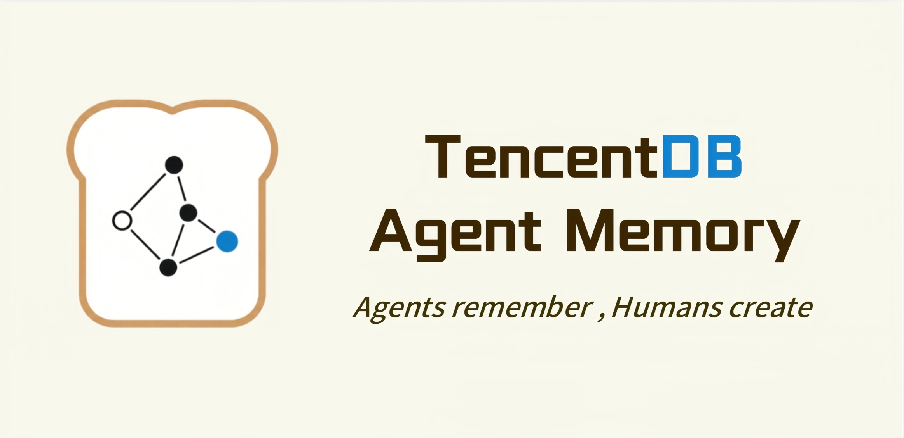

<div align="center">



### TencentDB Agent Memory

Help your Agent remember fixed workflows, accumulate past experience, and reuse user preferences — **so people can pull their attention out of repetitive work and back to creation, judgment, and life itself**.

[](https://www.npmjs.com/package/@tencentdb-agent-memory/memory-tencentdb)
[](./LICENSE)
[](https://nodejs.org/)
[](https://github.com/openclaw/openclaw)

[](https://discord.gg/kDtHb5RW2)

[Highlights](#-highlights) · [Overview](#overview) · [Quick Start](#quick-start) · [Design Highlights](#-design-highlights)

</div>

---

## ✨ Highlights

> **TencentDB Agent Memory = Short-term context compression + Long-term personalized memory.**
>
> - **Short-term context compression**: lighten the long-task context so the Agent no longer reasons while carrying every tool log on its back.
> - **Long-term personalized memory**: distill fragmented conversations into structured memories, scene blocks, and user personas.

**Plugged into OpenClaw**, it saves up to **61.38% tokens**, lifts pass rate by **+51.52%** (relative), and pushes PersonaMem accuracy from **48%** to **76%**.

| Memory Capability | Benchmark | Openclaw Success | With Plugin | Relative Δ | Openclaw Tokens | With Plugin Tokens | Relative Δ |
| :--- | :--- | :---: | :---: | :---: | :---: | :---: | :---: |
| **Short-term** | WideSearch | 33% | **50%** | **+51.52%** | 221.31M | **85.64M** | **−61.38%** |
| **Short-term** | SWE-bench | 58.4% | **64.2%** | **+9.93%** | 3474.1M | **2375.4M** | **−33.09%** |
| **Short-term** | AA-LCR | 44.0% | **47.5%** | **+7.95%** | 112.0M | **77.3M** | **−30.98%** |
| **Long-term** | PersonaMem | 48% | **76%** | **+59%** | — | — | — |

> These are long-session evaluations, not single-turn isolated runs. Multiple tasks are concatenated into the same session and executed back-to-back. For example, each SWE-bench session runs 50 tasks consecutively to simulate the context-accumulation pressure faced by a real long-horizon Agent.

---

## Overview

**Memory is not about letting AI store everything — it is about freeing humans from repeating everything.**

TencentDB Agent Memory helps the Agent learn your workflows, retain task context, and reuse past experience, so that humans can spend their attention on judgment, creation, and work that actually matters.

In real work, plenty of things should not need to be re-explained: fixed SOPs, common analysis conventions, project background, user preferences, and so on. We capture these stable experiences and let the Agent reuse them automatically when the moment is right.

TencentDB Agent Memory is not a plain chat log, not a one-way irreversible summary, and not just RAG. We design memory as a layered information management system: the database carries the searchable, filterable, recallable factual base; the file system carries the readable, editable, progressively-disclosable task canvases, scene blocks, and user personas. Short-term compression solves in-task information overload, while long-term personalized memory solves cross-session user understanding.

> **Let the Agent remember what should be remembered, so humans can focus on what is actually worth creating.**

It is built from two capabilities:

### Short-term Compression: Mermaid Infinite Canvas ✖️ Context Offload

In long tasks, what eats your context window is rarely the user's goal — it is the byproducts of tool calls: search results, web page bodies, file chunks, test logs, error traces, diffs, intermediate versions. TencentDB Agent Memory offloads these full payloads to external files, keeping only summaries, paths, and task state near the active context.

```text
Tool result
  └─► refs/*.md               full original payload
      └─► offload-*.jsonl     per-tool-call summary + result_ref
          └─► mmds/*.mmd      Mermaid task canvas
              └─► Context     only the structured state the current task needs
```

The point here is not "deleting history" but "folding history": most of the time the Agent looks at the task map; when it needs detail it drills down through `node_id` and `result_ref` back to the raw evidence.

### Long-term Personalized Memory: From Fragments to a User Persona

Cross-session memory is a different problem. Raw conversation logs are a low-density ore: they contain preferences, facts, emotions, long-term goals — and a lot of noise. Plain vector retrieval can only find "similar fragments" and rarely surfaces the user's stable, long-term traits.

TencentDB Agent Memory uses an L0 → L3 pyramid pipeline to refine information layer by layer:

<p align="center">
  
</p>

The upper layers help the Agent "understand you"; the lower layers back it up with factual detail. The Agent gets both the high-level read and the receipts when needed.

---

## Quick Start

### 1. Install the plugin

```bash
openclaw plugins install @tencentdb-agent-memory/memory-tencentdb
openclaw gateway restart
```

### 2. Zero-config to enable

Defaults to a local `SQLite + sqlite-vec` backend.

```jsonc
// ~/.openclaw/openclaw.json
{
  "memory-tencentdb": {
    "enabled": true
  }
}
```

Once enabled, TencentDB Agent Memory automatically handles conversation capture, memory extraction, scene aggregation, persona generation, and recall before the next turn.

### 3. Use the TCVDB backend (optional, requires version ≥ 0.2.0)

```jsonc
{
  "memory-tencentdb": {
    "storeBackend": "tcvdb",
    "tcvdb": {
      "url": "http://your-vdb-instance:8100",
      "apiKey": "your-api-key",
      "database": "my_memory_db"
    }
  }
}
```

### 4. Enable short-term compression (optional, requires version ≥ 0.3.0)

```jsonc
{
  "memory-tencentdb": {
    "offload": {
      "enabled": true
    }
  }
}
```

---

## 🔧 Configurable Parameters

**Every field has a sensible default — it runs with zero configuration.** When you want to tune, peel back the layers based on how deep you go.

<details>
<summary><b>🟢 Level 1 · Daily tuning</b> (covers 90% of use cases)</summary>

| Field | Default | Description |
| :--- | :--- | :--- |
| `storeBackend` | `"sqlite"` | Storage backend: `sqlite` / `tcvdb` |
| `recall.strategy` | `"hybrid"` | Recall strategy: `keyword` / `embedding` / `hybrid` (RRF fusion, recommended) |
| `recall.maxResults` | `5` | Number of items returned per recall |
| `pipeline.everyNConversations` | `5` | Trigger an L1 memory extraction every N turns |
| `extraction.maxMemoriesPerSession` | `20` | Max memories extracted per L1 pass |
| `persona.triggerEveryN` | `50` | Generate the user persona every N new memories |
| `offload.enabled` | `false` | Whether to enable short-term compression |

</details>

<details>
<summary><b>🟡 Level 2 · Advanced tuning</b> (long task / long session)</summary>

| Field | Default | Description |
| :--- | :--- | :--- |
| `pipeline.enableWarmup` | `true` | Warm-up: a new session triggers from turn 1, doubling each time up to N (1→2→4→…) |
| `pipeline.l1IdleTimeoutSeconds` | `600` | Trigger L1 after the user has been idle for this many seconds |
| `pipeline.l2MinIntervalSeconds` | `900` | Minimum interval between two L2 passes within the same session |
| `recall.timeoutMs` | `5000` | Recall timeout; on timeout, skip injection without blocking the conversation |
| `extraction.enableDedup` | `true` | L1 vector dedup / conflict detection |
| `capture.excludeAgents` | `[]` | Glob patterns to exclude specific agents (e.g. `bench-judge-*`) |
| `capture.l0l1RetentionDays` | `0` | Local retention days for L0 / L1 files; `0` = never clean up |
| `offload.mildOffloadRatio` | `0.5` | Mild compression trigger ratio (of context window) |
| `offload.aggressiveCompressRatio` | `0.85` | Aggressive compression trigger ratio |
| `offload.mmdMaxTokenRatio` | `0.2` | Token budget ratio for MMD injection |
| `bm25.language` | `"zh"` | Tokenizer language: `zh` (jieba) / `en` |

</details>

<details>
<summary><b>🔴 Level 3 · Full parameter reference</b> (ops / custom models / remote embedding)</summary>

For all fields, types, and constraints see [`openclaw.plugin.json`](./openclaw.plugin.json) and [`CONFIGURATION.md`](./CONFIGURATION.md).

- `embedding.*` — remote embedding service (OpenAI-compatible API)
- `tcvdb.*` — full Tencent Cloud Vector Database parameters (incl. HTTPS / self-signed CA)
- `llm.*` — standalone LLM mode (bypass OpenClaw's built-in model and run L1/L2/L3 with a designated API)
- `offload.backendUrl / backendApiKey` — offload the L1/L1.5/L2/L4 flow to a backend service
- `report.*` — metrics reporting

</details>

---

## 🤔 Design Highlights

### 1. Progressive disclosure: compress the task, accumulate the user

The point of TencentDB Agent Memory is not "store more" but **layering information by density and purpose**:

- **Short-term compression** solves "the current task is too long": offload raw tool results to external storage, fold the task structure into a Mermaid canvas.
- **Long-term personalized memory** solves "next time we meet, you don't know me": refine raw conversations layer by layer into structured memories, scene blocks, and a user persona.

Both share the same engineering principle: **lower layers preserve evidence, upper layers preserve structure; you read upper layers by default and drill down only when needed.**

| Direction | Lower: fidelity | Middle: organization | Upper: compression / abstraction | Goal |
| :--- | :--- | :--- | :--- | :--- |
| Short-term compression | `refs/*.md` raw tool result | `offload-*.jsonl` tool summary | `mmds/*.mmd` Mermaid task canvas / metadata | Keep long tasks moving instead of being dragged down by context |
| Long-term personalized memory | L0 raw conversation | L1 structured memory / L2 scene block | L3 user persona `persona.md` | Next time you show up, the Agent knows you better |

This lets the Agent work the way humans do: read the table of contents first, then chapters, and only crack open the raw material when needed. The context window stops being a desk that just keeps piling up — it becomes a workspace you can fold and unfold.

### 2. Long-term memory: the L0 → L3 semantic pyramid

Long-term memory is more than "save the chat log somewhere". The real value is mining stable preferences, implicit goals, and contextualized experience out of conversational fragments.

| Layer | Output | What changes |
| :--- | :--- | :--- |
| L0 | Raw conversation | Preserves the factual base, but with the most noise and the lowest density |
| L1 | Structured atomic memory | Clean facts extracted from the dialogue, suitable for semantic + temporal retrieval |
| L2 | Scene block | Aggregates related memories into scenes — understand "how the user behaves in this kind of situation" |
| L3 | User persona | Distills long-term preferences, stable traits, and decision style as a high-density context to inject |

The shape mirrors a DIKW pyramid: from Data to Information to Knowledge to Wisdom. The Agent stops merely recalling "what the user said" and starts understanding "what the user might need".

### 3. Macro persona + micro facts: one drill-down mechanism to reduce hallucination

The biggest risk of compression is "saving tokens but losing the receipts". So TencentDB Agent Memory does not collapse history into an irreversible summary — it keeps a clear path from high-level abstraction back to ground-truth evidence.

| Question type | First look at | Drill down to |
| :--- | :--- | :--- |
| Daily preferences, voice, long-term goals | L3 Persona / L2 Scene | Hit L1 / L0 when facts are needed |
| Specific facts, dates, project details | L1 Memory / L0 Conversation | Widen the time range or use semantic recall when hits are sparse |
| Continuing a long-running task | Active MMD task canvas | Check the JSONL when the summary is thin, then read `refs/*.md` for raw text |
| Resuming a historical task | Metadata task entry | Open the MMD → find `node_id` → trace `result_ref` |

The upper layer carries "judgment" and direction; the lower layer carries "evidence" and precision. Short-term compression and long-term memory close into one loop: **foldable and unfoldable; abstract yet auditable.**

### 4. White-box debuggable: memory is not a black-box vector

Many memory systems break here: when recall is wrong, all you see is a list of vector scores, and you cannot tell where things went sideways. TencentDB Agent Memory keeps the key intermediates as readable files:

- L2 scene blocks are Markdown — open and inspect directly.
- L3 personas live in `persona.md` and trace back to the scenes that produced them.
- Short-term task canvases are Mermaid — readable to humans and to Agents.
- Raw payloads, summaries, and nodes are linked by `result_ref` and `node_id`.

Debugging is no longer rummaging through a black-box database — it is walking the chain "persona → scene → memory → raw text" until the issue surfaces.

### 5. Heterogeneous storage decoupled: DB for facts, file system for structure

Long-term memory and short-term compression look like two features but follow the same storage principle underneath: **the database stores searchable facts; the file system stores readable, editable structure.**

| Information type | Storage medium | Why this placement |
| :--- | :--- | :--- |
| L0 / L1 long-term memory base | SQLite or TCVDB | Large volume; needs semantic recall and temporal lookup |
| L2 / L3 scenes and persona | Markdown files | Must be human-readable, prompt-tunable, progressively disclosable |
| Offload raw payloads | `refs/*.md` | Raw evidence must be kept in full but should not live in the context |
| Offload summaries | JSONL | Easy to look up tool-call history by `node_id` |
| Offload task structure | Mermaid files | So both Agents and humans can see how the task is moving |

The lower stack is the armory: stable, complete, retrievable. The upper stack is the battle map: flexible, readable, fast to iterate. The short-term canvas and the long-term persona are both, at heart, **high-density working surfaces the Agent can read.**

### 6. Production-ready engineering: a real plugin, not a demo

| Capability | Description |
| :--- | :--- |
| OpenClaw plugin | Capture, extract, and recall memory automatically once installed |
| Hermes Gateway adapter | `TdaiCore + HostAdapter` decoupled from the host framework |
| Dual backends | Local `SQLite + sqlite-vec`, or remote `TCVDB` |
| Hybrid retrieval | BM25 + vector + RRF — both keyword and semantic recall |
| Agent tools | `tdai_memory_search` / `tdai_conversation_search` |
| Data migration | Historical import, SQLite → TCVDB migration, VDB export |

---

## Documentation

| Document | Contents |
| :--- | :--- |
| [`CONFIGURATION.md`](./CONFIGURATION.md) | Full configuration reference, field descriptions, and advanced parameters |
| [`scripts/README.memory-tencentdb-ctl.md`](./scripts/README.memory-tencentdb-ctl.md) | Operations & management tooling |
| [`CHANGELOG.md`](./CHANGELOG.md) | Release notes and version history |
| [`openclaw.plugin.json`](./openclaw.plugin.json) | OpenClaw plugin manifest and configuration schema |

---

## Community & Contributing

We welcome every kind of contribution — bug reports, feature ideas, doc fixes, benchmark reproductions, ecosystem integrations, or a Pull Request. Agent memory is far from a solved problem, and we'd love to figure it out together.

- 🐞 **Found a bug or have a question?** Open an issue at [GitHub Issues](https://github.com/Tencent/TencentDB-Agent-Memory/issues) — we respond within 24 hours.
- 💡 **Have an idea to share?** Start a thread in [GitHub Discussions](https://github.com/Tencent/TencentDB-Agent-Memory/discussions).
- 🛠️ **Want to contribute code?** Please read [CONTRIBUTING.md](./CONTRIBUTING.md) first.
- 💬 **Want to chat with us?** Join our [Discord community](https://discord.gg/kDtHb5RW2) and talk to the early developers directly.

---

## Roadmap

- [x] Long-term personalized memory (L0 → L3)
- [x] Short-term context compression (Context Offload + Mermaid canvas)
- [x] Local SQLite backend and Tencent Cloud Vector Database (TCVDB) backend
- [x] OpenClaw plugin and Hermes Gateway integration
- [ ] Short-term compression GA release
- [ ] Portable memory: cross-Agent / cross-framework / cross-device import, export, and live migration
- [ ] More Agent framework adapters
- [ ] Visual debugging and memory observability dashboard

---

<table>
  <tr>
    <td width="68%">
      <b>If TencentDB Agent Memory has been useful to you, please give the project a ⭐ to support us.</b><br />
      For any suggestions, feel free to open an issue and start the discussion.
    </td>
    <td width="32%" align="right">
      
    </td>
  </tr>
</table>

[MIT](./LICENSE) © TencentDB Agent Memory Team
