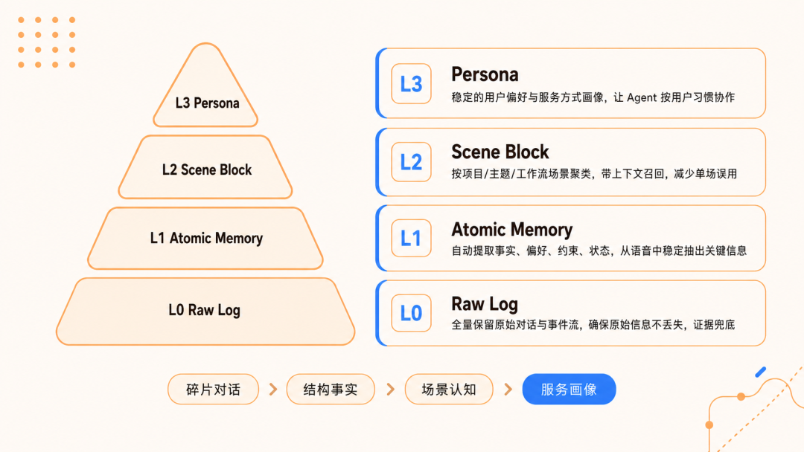

<div align="center">


### TencentDB Agent Memory

面向生产级 Agent 的自进化记忆基础设施 —— **短期压缩 × 长期沉淀**。

[](https://www.npmjs.com/package/@tencentdb-agent-memory/memory-tencentdb)
[](./LICENSE)
[](https://nodejs.org/)
[](https://github.com/openclaw/openclaw)


[效果亮点](#效果亮点) · [项目简介](#项目简介) · [特点](#特点) · [快速开始](#快速开始)

</div>

---

## ✨ 效果亮点

> **TencentDB Agent Memory = 短期记忆压缩 + 长期个性化记忆。**
>
> - **短期记忆压缩**：把长任务上下文变轻，让 Agent 不再背着全部工具日志继续推理。
> - **长期个性化记忆**：把碎片化对话提炼为结构化记忆、场景块和用户画像。

**作为 OpenClaw 插件接入后**：最高节省 **63.59% Token**，通过率相对提升 **41.18%**；PersonaMem 准确率从 **48%** 提升到 **76%**。

| 记忆能力 | 场景 / Benchmark | 提升效果 |
| :--- | :--- | :--- |
| **短期记忆压缩** | WideSearch 200 题网页搜索 | Token 最高节省 **63.59%**，通过率相对提升 **41.18%** |
| **短期记忆压缩** | SWE-bench 500 题代码修复 | 完成率 **58.4% → 64.2%**，相对提升 **9.93%**，Token 节省 **33.09%** |
| **短期记忆压缩** | AA-LCR 800 题长文分析 | 准确率 **44.0% → 47.5%**，总 Token 节省 **31%** |
| **长期个性化记忆** | PersonaMem：6000+ 消息 / 589 题 | 准确率 **48% → 76%**，相对提升 **59%** |

> 超长 Session 评测不是单题清空上下文，而是把多个任务拼接到同一个 Session 中连续执行。例如 SWE-bench 每个 Session 连续执行 50 个任务，用来模拟真实长程 Agent 的上下文累积压力。

---

## 简单介绍

**TencentDB Agent Memory 不是把历史暴力堆进上下文，也不是把一切压成不可恢复的摘要。**

我们把记忆设计成一套分层信息管理系统：低层保留原始证据，高层保留语义结构；当前需要的进入上下文，暂时不用的外部化保存，需要时再沿着索引找回。

数据库负责事实检索，文件系统负责任务画布、场景块和用户画像。短期记忆压缩解决长任务中的过程信息过载，长期个性化记忆解决跨会话的用户理解沉淀。

> **让 Agent 少背负，但不丢失；少重复，但能追溯。**

它由两块能力组成：

### 短期记忆压缩：Mermaid无限画布 ✖️ 上下文卸载

长任务里最占上下文的往往不是用户目标，而是工具调用产生的过程信息：搜索结果、网页正文、文件片段、测试日志、报错、diff、中间版本。TencentDB Agent Memory 会把这些完整信息卸载到外部文件，只把摘要、路径和任务状态保留在上下文附近。

```text
工具结果
  └─► refs/*.md               保存完整原文
      └─► offload-*.jsonl     保存工具调用级摘要与 result_ref
          └─► mmds/*.mmd      保存 Mermaid 任务画布
              └─► 上下文      只注入当前任务最需要的结构化状态
```

这里的关键不是“删掉历史”，而是“折叠历史”：Agent 平时看任务地图，需要细节时再沿着 `node_id` 和 `result_ref` 下钻到原始证据。

### 长期个性化记忆：从信息碎片到用户画像

跨会话记忆面对的是另一个问题：原始对话日志是低密度矿藏，里面有偏好、有事实、有情绪、有长期目标，也有大量噪音。单纯向量检索只能找到“相似片段”，很难挖出用户长期稳定的特质。

TencentDB Agent Memory 用 L0 → L3 的金字塔管线逐层提纯：

<p align="center">
  
</p>

上层画像负责让 Agent “懂你”，下层记忆负责在事实细节上兜底。这样 Agent 既能有宏观判断，也能在需要时查到具体证据。

---

## 快速开始

### 1. 安装插件

```bash
openclaw plugins install @tencentdb-agent-memory/memory-tencentdb
openclaw gateway restart
```

### 2. 零配置启用

默认使用本地 `SQLite + sqlite-vec` 后端。

```jsonc
// ~/.openclaw/openclaw.json
{
  "memory-tencentdb": {
    "enabled": true
  }
}
```

启用后，TencentDB Agent Memory 会自动完成对话录制、记忆提取、场景归纳、用户画像生成和下一轮对话前召回。

### 3. 使用 TCVDB 后端（可选）

```jsonc
{
  "memory-tencentdb": {
    "storeBackend": "tcvdb",
    "tcvdb": {
      "url": "http://your-vdb-instance:8100",
      "apiKey": "your-api-key",
      "database": "my_memory_db"
    }
  }
}
```

### 4. 启用短期记忆压缩（可选）

```jsonc
{
  "memory-tencentdb": {
    "offload": {
      "enabled": true
    }
  }
}
```

### 5. 常用命令

```bash
# 导入历史对话，完整执行 L0 → L3 管线
openclaw memory-tdai seed --input conversations.json

# SQLite 数据迁移到 TCVDB
migrate-sqlite-to-tcvdb --help

# 导出腾讯云向量数据库数据
export-tencent-vdb --help
```

完整配置见 [`CONFIGURATION.md`](./CONFIGURATION.md)，CLI 输入格式见 [`src/cli/README.md`](./src/cli/README.md)。

---

## 🔧 可调参数

**所有字段均有合理默认值，零配置即可跑。** 如果要调优，可以按使用深度逐层展开。

<details>
<summary><b>🟢 Level 1 · 日常调参</b>（覆盖 90% 使用场景）</summary>

| 字段 | 默认 | 说明 |
| :--- | :--- | :--- |
| `storeBackend` | `"sqlite"` | 存储后端：`sqlite` / `tcvdb` |
| `recall.strategy` | `"hybrid"` | 召回策略：`keyword` / `embedding` / `hybrid`（RRF 融合，推荐） |
| `recall.maxResults` | `5` | 每次召回条数 |
| `pipeline.everyNConversations` | `5` | 每 N 轮对话触发一次 L1 记忆提取 |
| `extraction.maxMemoriesPerSession` | `20` | 单次 L1 最多提取多少条 |
| `persona.triggerEveryN` | `50` | 每 N 条新记忆触发用户画像生成 |
| `offload.enabled` | `false` | 是否启用短期记忆压缩 |

</details>

<details>
<summary><b>🟡 Level 2 · 进阶调优</b>（长任务 / 长 Session 场景）</summary>

| 字段 | 默认 | 说明 |
| :--- | :--- | :--- |
| `pipeline.enableWarmup` | `true` | Warm-up：新 session 从 1 轮起触发，每次翻倍至 N（1→2→4→…） |
| `pipeline.l1IdleTimeoutSeconds` | `600` | 用户停止对话多久后触发 L1 |
| `pipeline.l2MinIntervalSeconds` | `900` | 同 session 两次 L2 之间的最小间隔 |
| `recall.timeoutMs` | `5000` | 召回超时阈值，超时跳过注入不阻塞对话 |
| `extraction.enableDedup` | `true` | L1 向量去重 / 冲突检测 |
| `capture.excludeAgents` | `[]` | Glob 模式排除特定 Agent（如 `bench-judge-*`） |
| `capture.l0l1RetentionDays` | `0` | L0/L1 本地文件保留天数，`0` = 永不清理 |
| `offload.mildOffloadRatio` | `0.5` | 温和压缩触发比例（占 context window） |
| `offload.aggressiveCompressRatio` | `0.85` | 激进压缩触发比例 |
| `offload.mmdMaxTokenRatio` | `0.2` | MMD 注入 token 预算比例 |
| `bm25.language` | `"zh"` | 分词语言：`zh`（jieba） / `en` |

</details>

<details>
<summary><b>🔴 Level 3 · 完整参数表</b>（运维 / 自定义模型 / 远程 embedding）</summary>

完整字段、类型、约束见 [`openclaw.plugin.json`](./openclaw.plugin.json) 与 [`CONFIGURATION.md`](./CONFIGURATION.md)。

- `embedding.*` — 远程 embedding 服务（OpenAI 兼容 API）
- `tcvdb.*` — 腾讯云向量数据库完整参数（含 HTTPS / 自签 CA）
- `llm.*` — 独立 LLM 模式（绕过 OpenClaw 内置模型，用指定 API 跑 L1/L2/L3）
- `offload.backendUrl / backendApiKey` — 将 L1/L1.5/L2/L4 offload 流程卸载到后端服务
- `report.*` — 指标上报

</details>

---

## 🤔 方案特点

### 1. 渐进式披露：短期压缩任务，长期沉淀用户

TencentDB Agent Memory 的核心不是“多存一点”，而是**把信息按密度和用途分层**：

- **短期记忆压缩**解决“当前任务太长”的问题：把原始工具结果卸载到外部，把任务结构折叠成 Mermaid 画布。
- **长期个性化记忆**解决“下次见面不认识你”的问题：把原始对话逐层提纯成结构化记忆、场景块和用户画像。

两者共享同一条工程逻辑：**低层保留证据，高层保留结构；平时看高层，需要时下钻到底层。**

| 方向 | 低层：保真 | 中层：组织 | 高层：压缩 / 抽象 | 目标 |
| :--- | :--- | :--- | :--- | :--- |
| 短期记忆压缩 | `refs/*.md` 原始工具结果 | `offload-*.jsonl` 工具摘要 | `mmds/*.mmd` Mermaid 任务画布 / metadata | 长任务继续做，不被上下文拖垮 |
| 长期个性化记忆 | L0 原始对话 | L1 结构化记忆 / L2 场景块 | L3 用户画像 `persona.md` | 下次再见面，Agent 更懂用户 |

这让 Agent 可以像人一样工作：先看目录，再看章节，最后才翻原始资料。上下文窗口不再是一张越堆越满的桌子，而是一张可以折叠和展开的工作台。

### 2. 长期个性化记忆：L0 → L3 语义金字塔

长期记忆不是“把聊天记录存起来”这么简单。真正有价值的是从对话碎片中挖出稳定偏好、隐含目标和场景化经验。

| 层级 | 产物 | 信息变化 |
| :--- | :--- | :--- |
| L0 | 原始对话 | 保留事实底座，但噪音最大、密度最低 |
| L1 | 结构化原子记忆 | 从对话中提取干净事实，适合语义 + 时序检索 |
| L2 | 场景块 | 将相关记忆聚合成场景，理解“在某类情境下用户如何行动” |
| L3 | 用户画像 | 提炼长期偏好、稳定特质和决策风格，作为高密度上下文注入 |

这套结构类似 DIKW 金字塔：从 Data 到 Information，再到 Knowledge，最后变成 Wisdom。它让 Agent 不只是回忆“用户说过什么”，而是理解“用户可能需要什么”。

### 3. 宏观画像 + 微观事实：同一套下钻机制降低幻觉

压缩最大的风险是“省了 Token，也丢了证据”。因此 TencentDB Agent Memory 没有把历史压成一段不可恢复的 summary，而是保留了从高层摘要回到底层证据的路径。

| 问题类型 | 优先使用 | 继续下钻 |
| :--- | :--- | :--- |
| 日常偏好、表达风格、长期目标 | L3 Persona / L2 Scene | 需要事实时查 L1 / L0 |
| 具体事实、时间、项目细节 | L1 Memory / L0 Conversation | 命中不足时扩大时间范围或语义检索 |
| 当前长任务继续执行 | Active MMD 任务画布 | 摘要不够时查 JSONL，再读 `refs/*.md` 原文 |
| 历史任务恢复 | Metadata 任务入口 | 打开 MMD → 找 node_id → 追 result_ref |

上层负责“情商”和方向，下层负责“证据”和精度。短期压缩和长期记忆在这里合成一条闭环：**能折叠，也能展开；能抽象，也能追证。**

### 4. 白盒可调试：记忆不是黑盒向量

很多记忆系统的问题是：召回错了，你只能看到一串向量分数，很难判断到底哪里错。TencentDB Agent Memory 把关键中间产物保存在可读文件里：

- L2 场景块是 Markdown，可以直接打开检查。
- L3 用户画像是 `persona.md`，可以追溯到对应场景。
- 短期任务画布是 Mermaid，既能给人看，也能给 Agent 读。
- 原文、摘要、节点之间有 `result_ref` 和 `node_id` 关联。

这意味着调试不再是翻黑盒数据库，而是沿着“画像 → 场景 → 记忆 → 原文”的链路逐层定位。

### 5. 异构存储解耦：数据库保事实，文件系统保结构

长期记忆和短期压缩看起来是两套功能，底层其实遵循同一条存储原则：**数据库负责可检索的事实，文件系统负责可读可改的结构。**

| 信息类型 | 存储介质 | 为什么这样放 |
| :--- | :--- | :--- |
| L0 / L1 长期记忆底座 | SQLite 或 TCVDB | 数据量大、需要语义检索和时序查证 |
| L2 / L3 场景与画像 | Markdown 文件 | 需要业务可读、Prompt 可调、渐进式披露 |
| Offload 原文 | `refs/*.md` | 原始证据必须完整保留，但不应常驻上下文 |
| Offload 摘要 | JSONL | 方便按 `node_id` 检索工具调用历史 |
| Offload 任务结构 | Mermaid 文件 | 让 Agent 和人都能看懂任务如何推进 |

底层像弹药库，负责稳定、完整、可检索；顶层像作战地图，负责灵活、可读、能快速迭代。短期压缩的画布和长期记忆的画像，本质上都是“给 Agent 看得懂的高密度工作面”。

### 6. 工程能力完整：不是 Demo，而是可接入的插件

| 能力 | 说明 |
| :--- | :--- |
| OpenClaw 插件 | 安装后即可自动捕获、提取、召回记忆 |
| Hermes Gateway 适配 | `TdaiCore + HostAdapter` 解耦宿主框架 |
| 双后端 | 本地 `SQLite + sqlite-vec`，或远端 `TCVDB` |
| 混合检索 | BM25 + 向量 + RRF，兼顾关键词和语义召回 |
| Agent 工具 | `tdai_memory_search` / `tdai_conversation_search` |
| 数据迁移 | 支持历史导入、SQLite → TCVDB 迁移、VDB 导出 |

---

## 文档

| 文档 | 内容 |
| :--- | :--- |
| [`CONFIGURATION.md`](./CONFIGURATION.md) | 完整配置参考、字段说明与高级参数 |
| [`src/cli/README.md`](./src/cli/README.md) | `openclaw memory-tdai seed` 历史对话导入说明 |
| [`scripts/README.memory-tencentdb-ctl.md`](./scripts/README.memory-tencentdb-ctl.md) | 运维管理工具说明 |
| [`CHANGELOG.md`](./CHANGELOG.md) | 版本变更记录 |
| [`openclaw.plugin.json`](./openclaw.plugin.json) | OpenClaw 插件声明与配置 Schema |

---

## Roadmap

- [x] 长期个性化记忆（L0 → L3）
- [x] 短期记忆压缩（Context Offload + Mermaid 画布）
- [x] 本地 SQLite 后端与腾讯云向量数据库 TCVDB 后端
- [x] OpenClaw 插件与 Hermes Gateway 适配
- [ ] 短期记忆压缩正式产品化上线
- [ ] 记忆可迁移：跨 Agent / 跨框架 / 跨设备的导入导出与热迁移
- [ ] 更多 Agent 框架适配
- [ ] 可视化调试与记忆观测面板

---

<table>
  <tr>
    <td width="68%">
      <b>如果 TencentDB Agent Memory 对你有所帮助，欢迎为项目点亮 ⭐ 支持。</b><br />
      如果有任何建议，欢迎提出issue讨论。
    </td>
    <td width="32%" align="right">
      
    </td>
  </tr>
</table>

[MIT](./LICENSE) © TencentDB Agent Memory Team
