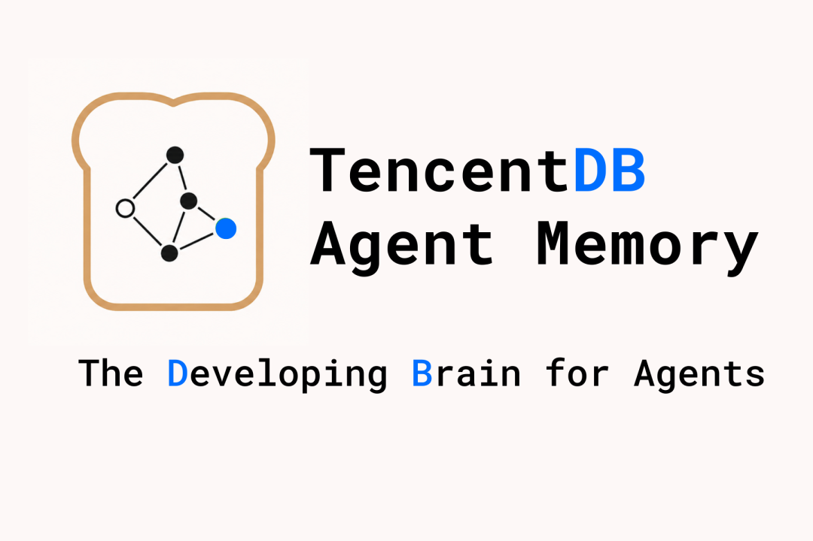
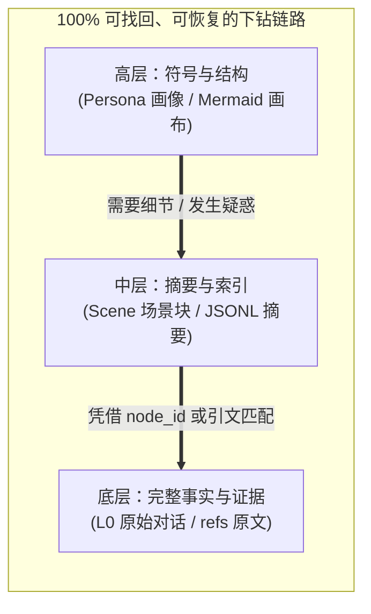
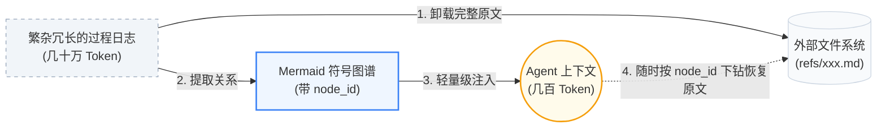
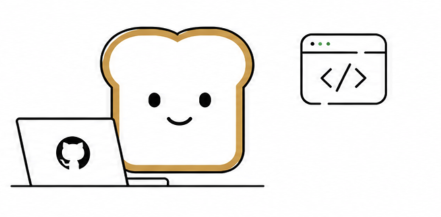

<div align="center">



### 让 Agent 沉淀经验，让人专注创造。


[](https://www.npmjs.com/package/@tencentdb-agent-memory/memory-tencentdb)
[](./LICENSE)
[](https://nodejs.org/)
[](https://github.com/openclaw/openclaw)


[效果亮点](#效果亮点) · [项目简介](#项目简介) · [特点](#特点) · [快速开始](#快速开始)

</div>

---

## ✨ 效果亮点

> **TencentDB Agent Memory = 符号化短期记忆 + 分层式长期记忆。**
>
> - **符号化短期记忆**：将厚重的工具日志分层卸载，逐步总结成轻量级 Mermaid 结构符号，大幅降低 Token 消耗的同时提升任务成功率。
> - **分层式长期记忆**：把碎片化对话层层提炼，沉淀出有层次的画像与场景，不再是扁平的向量堆砌。

**作为 OpenClaw 插件接入后**：最高节省 **61.38% Token**，通过率相对提升 **51.52%**；PersonaMem 准确率从 **48%** 提升到 **76%**。

| 记忆能力 | Benchmark | Openclaw 成功率 | 加插件后成功率 | 相对变化 | Openclaw Token 消耗 | 加插件后 Token 消耗 | 相对变化 |
| :------ | :--- | :---: | :---: | :---: | :---: | :---: | :---: |
| **短期记忆** | WideSearch | 33% | **50%** | **+51.52%** | 221.31M | **85.64M** | **−61.38%** |
| **短期记忆** | SWE-bench | 58.4% | **64.2%** | **+9.93%** | 3474.1M | **2375.4M** | **−33.09%** |
| **短期记忆** | AA-LCR | 44.0% | **47.5%** | **+7.95%** | 112.0M | **77.3M** | **−31%** |
| **长期记忆** | PersonaMem | 48% | **76%** | **+59%** | — | — | — |

> 超长 Session 评测不是单题清空上下文，而是把多个任务拼接到同一个 Session 中连续执行。例如 SWE-bench 每个 Session 连续执行 50 个任务，用来模拟真实长程 Agent 的上下文累积压力。

---


## 项目简介

**Memory 不是为了让 AI 存下所有东西，而是为了让人不必重复所有事情。**

在实际使用中，我们往往需要反复告诉 Agent 固定 SOP、项目背景、工具习惯和输出格式。这些信息不应该每次重新解释，但同时也不应该被无脑、扁平地全部塞进上下文。

TencentDB Agent Memory 帮助 Agent 学会你的流程、保留任务上下文、复用历史经验。但我们**拒绝暴力的历史堆砌**，也**抛弃不可逆的暴力摘要**。我们将记忆设计为一套极具层次感的系统，以**符号化记忆**解决单次长任务的信息过载，以**记忆分层**解决跨会话的经验沉淀。

> **让 Agent 记住该记的，让人把注意力留给判断、创造和真正有价值的工作。**

---

## 核心技术：拒绝平铺，走向分层与符号化

TencentDB Agent Memory 的设计理念围绕两个核心展开：**记忆分层** 与 **符号化记忆**。这不仅让 Agent “记得更多”，更重要的是“想得更清”。

### 1. 记忆分层：渐进式披露与异构存储

传统的记忆系统往往将所有数据切片并平铺为向量，召回时如同在一堆毫无关联的便利贴中寻找线索，缺乏宏观视角的指引。

我们认为，**不管是长期的知识、短期的任务，还是未来的经验能力，记忆都不应该平铺，生成和召回都必须有层次**。TencentDB Agent Memory 将“分层”作为整个架构的统一设计哲学：

*   **短期记忆（上下文卸载/任务）的分层**：底层保留原始、厚重的工具调用结果（`refs/*.md`），中层抽取步骤摘要（`jsonl`），高层则浓缩为一张极度轻量的 Mermaid 任务画布。Agent 在上下文中仅需关注高层结构，遇错时再沿着 `node_id` 下钻到底层查证。
*   **长期个性化（用户理解）的分层**：打破扁平的历史记录，建立 L0 原始对话 → L1 结构化事实 → L2 场景块 → L3 用户画像 的语义金字塔。平时靠高层画像把握用户偏好，需要考证细节时再检索底层事实。
*   **技能生成（Skill与动作沉淀，Roadmap）的分层**：记忆不应仅限于“知道什么”，还应包括“会做什么”。我们正在将分层延伸至动作域：从底层的执行轨迹（Traces）与报错日志中，中层归纳出共性的解决模式，高层最终提炼出可直接挂载复用的 Skill 或标准 SOP 代码。

<p align="center">
  
</p>

**渐进式披露与异构存储**：为了支撑这种无处不在的分层，我们设计了底层数据库与上层文件系统结合的存储方案。底层（海量事实、日志、轨迹）存入数据库或归档文件，确保稳定与全量检索；高层（画像、场景、画布、Skill）存入业务可读的文件系统（Markdown），确保高信息密度、逻辑清晰与白盒可调。**低层保留证据，高层保留结构。**

**每一条信息都 100% 可找回、可恢复**：压缩或抽象最大的风险是“丢失证据”。得益于严格的索引映射机制，系统内没有任何一段摘要是“不可逆”的黑盒。无论是短期记忆中被卸载的一段报错日志，还是长期记忆里总结出的一条用户偏好，Agent 或开发者都可以沿着“高层符号（画像/画布） → 中层索引（场景/JSONL） → 底层原文（L0对话/refs）”的链路进行完美溯源与恢复。



### 2. 符号化记忆：用最少符号表达最多语义（Mermaid 画布）

长程任务中最消耗 Token 的往往是繁杂的过程日志（如搜索结果、代码、报错）。为此，我们结合 **上下文卸载 (Context Offloading)** 提出了 **符号化记忆**：

*   **Mermaid 符号图谱**：取代冗长的自然语言或扁平的 JSON，我们使用高密度、强拓扑的 Mermaid 语法来描绘任务状态流转，既能被 LLM 精准理解，也方便人类阅览。
*   **历史折叠与卸载**：完整工具日志被卸载到外部文件系统，上下文仅保留轻量级的 Mermaid 任务地图。
*   **基于 `node_id` 的溯源**：Agent 看着符号图谱推理，如需核对细节，直接 grep 图谱上的 `node_id` 即可瞬间找回完整原文，既大幅降本又保全了 100% 可追溯性。



---

## 快速开始

### 1. 安装插件

```bash
openclaw plugins install @tencentdb-agent-memory/memory-tencentdb
openclaw gateway restart
```

### 2. 零配置启用

默认使用本地 `SQLite + sqlite-vec` 后端。

```jsonc
// ~/.openclaw/openclaw.json
{
  "memory-tencentdb": {
    "enabled": true
  }
}
```

启用后，TencentDB Agent Memory 会自动完成对话录制、记忆提取、场景归纳、用户画像生成和下一轮对话前召回。

### 3. 使用 TCVDB 后端（可选）

```jsonc
{
  "memory-tencentdb": {
    "storeBackend": "tcvdb",
    "tcvdb": {
      "url": "http://your-vdb-instance:8100",
      "apiKey": "your-api-key",
      "database": "my_memory_db"
    }
  }
}
```

### 4. 启用短期记忆压缩（可选）

```jsonc
{
  "memory-tencentdb": {
    "offload": {
      "enabled": true
    }
  }
}
```

### 5. 常用命令

```bash
# 导入历史对话，完整执行 L0 → L3 管线
openclaw memory-tdai seed --input conversations.json

# SQLite 数据迁移到 TCVDB
migrate-sqlite-to-tcvdb --help

# 导出腾讯云向量数据库数据
export-tencent-vdb --help
```

完整配置见 [`CONFIGURATION.md`](./CONFIGURATION.md)，CLI 输入格式见 [`src/cli/README.md`](./src/cli/README.md)。

---

## 🔧 可调参数

**所有字段均有合理默认值，零配置即可跑。** 如果要调优，可以按使用深度逐层展开。

<details>
<summary><b>🟢 Level 1 · 日常调参</b>（覆盖 90% 使用场景）</summary>

| 字段 | 默认 | 说明 |
| :--- | :--- | :--- |
| `storeBackend` | `"sqlite"` | 存储后端：`sqlite` / `tcvdb` |
| `recall.strategy` | `"hybrid"` | 召回策略：`keyword` / `embedding` / `hybrid`（RRF 融合，推荐） |
| `recall.maxResults` | `5` | 每次召回条数 |
| `pipeline.everyNConversations` | `5` | 每 N 轮对话触发一次 L1 记忆提取 |
| `extraction.maxMemoriesPerSession` | `20` | 单次 L1 最多提取多少条 |
| `persona.triggerEveryN` | `50` | 每 N 条新记忆触发用户画像生成 |
| `offload.enabled` | `false` | 是否启用短期记忆压缩 |

</details>

<details>
<summary><b>🟡 Level 2 · 进阶调优</b>（长任务 / 长 Session 场景）</summary>

| 字段 | 默认 | 说明 |
| :--- | :--- | :--- |
| `pipeline.enableWarmup` | `true` | Warm-up：新 session 从 1 轮起触发，每次翻倍至 N（1→2→4→…） |
| `pipeline.l1IdleTimeoutSeconds` | `600` | 用户停止对话多久后触发 L1 |
| `pipeline.l2MinIntervalSeconds` | `900` | 同 session 两次 L2 之间的最小间隔 |
| `recall.timeoutMs` | `5000` | 召回超时阈值，超时跳过注入不阻塞对话 |
| `extraction.enableDedup` | `true` | L1 向量去重 / 冲突检测 |
| `capture.excludeAgents` | `[]` | Glob 模式排除特定 Agent（如 `bench-judge-*`） |
| `capture.l0l1RetentionDays` | `0` | L0/L1 本地文件保留天数，`0` = 永不清理 |
| `offload.mildOffloadRatio` | `0.5` | 温和压缩触发比例（占 context window） |
| `offload.aggressiveCompressRatio` | `0.85` | 激进压缩触发比例 |
| `offload.mmdMaxTokenRatio` | `0.2` | MMD 注入 token 预算比例 |
| `bm25.language` | `"zh"` | 分词语言：`zh`（jieba） / `en` |

</details>

<details>
<summary><b>🔴 Level 3 · 完整参数表</b>（运维 / 自定义模型 / 远程 embedding）</summary>

完整字段、类型、约束见 [`openclaw.plugin.json`](./openclaw.plugin.json) 与 [`CONFIGURATION.md`](./CONFIGURATION.md)。

- `embedding.*` — 远程 embedding 服务（OpenAI 兼容 API）
- `tcvdb.*` — 腾讯云向量数据库完整参数（含 HTTPS / 自签 CA）
- `llm.*` — 独立 LLM 模式（绕过 OpenClaw 内置模型，用指定 API 跑 L1/L2/L3）
- `offload.backendUrl / backendApiKey` — 将 L1/L1.5/L2/L4 offload 流程卸载到后端服务
- `report.*` — 指标上报

</details>

---

## 🤔 方案特点

### 1. 宏观画像 + 微观事实：同一套下钻机制降低幻觉

压缩最大的风险是“省了 Token，也丢了证据”。因此 TencentDB Agent Memory 没有把历史压成一段不可恢复的 summary，而是保留了从高层摘要回到底层证据的路径。

| 问题类型 | 优先使用 | 继续下钻 |
| :--- | :--- | :--- |
| 日常偏好、表达风格、长期目标 | L3 Persona / L2 Scene | 需要事实时查 L1 / L0 |
| 具体事实、时间、项目细节 | L1 Memory / L0 Conversation | 命中不足时扩大时间范围或语义检索 |
| 当前长任务继续执行 | Active MMD 任务画布 | 摘要不够时查 JSONL，再读 `refs/*.md` 原文 |
| 历史任务恢复 | Metadata 任务入口 | 打开 MMD → 找 node_id → 追 result_ref |

上层负责“情商”和方向，下层负责“证据”和精度。短期压缩和长期记忆在这里合成一条闭环：**能折叠，也能展开；能抽象，也能追证。**

### 2. 白盒可调试：记忆不是黑盒向量

很多记忆系统的问题是：召回错了，你只能看到一串向量分数，很难判断到底哪里错。TencentDB Agent Memory 把关键中间产物保存在可读文件里：

- L2 场景块是 Markdown，可以直接打开检查。
- L3 用户画像是 `persona.md`，可以追溯到对应场景。
- 短期任务画布是 Mermaid，既能给人看，也能给 Agent 读。
- 原文、摘要、节点之间有 `result_ref` 和 `node_id` 关联。

这意味着调试不再是翻黑盒数据库，而是沿着“画像 → 场景 → 记忆 → 原文”的链路逐层定位。

### 3. 工程能力完整：不是 Demo，而是可接入的插件

| 能力 | 说明 |
| :--- | :--- |
| OpenClaw 插件 | 安装后即可自动捕获、提取、召回记忆 |
| Hermes Gateway 适配 | `TdaiCore + HostAdapter` 解耦宿主框架 |
| 双后端 | 本地 `SQLite + sqlite-vec`，或远端 `TCVDB` |
| 混合检索 | BM25 + 向量 + RRF，兼顾关键词和语义召回 |
| Agent 工具 | `tdai_memory_search` / `tdai_conversation_search` |
| 数据迁移 | 支持历史导入、SQLite → TCVDB 迁移、VDB 导出 |

---

## 文档

| 文档 | 内容 |
| :--- | :--- |
| [`CONFIGURATION.md`](./CONFIGURATION.md) | 完整配置参考、字段说明与高级参数 |
| [`src/cli/README.md`](./src/cli/README.md) | `openclaw memory-tdai seed` 历史对话导入说明 |
| [`scripts/README.memory-tencentdb-ctl.md`](./scripts/README.memory-tencentdb-ctl.md) | 运维管理工具说明 |
| [`CHANGELOG.md`](./CHANGELOG.md) | 版本变更记录 |
| [`openclaw.plugin.json`](./openclaw.plugin.json) | OpenClaw 插件声明与配置 Schema |

---
## 社区与贡献

我们欢迎一切形式的贡献——Bug 反馈、功能建议、文档勘误、Benchmark 复现、生态集成，或者一个 Pull Request 都可以。Agent 记忆这件事远未有定论，希望和大家一起把它做出来。

- 🐞 **发现 Bug 或有疑问？** 欢迎到 [GitHub Issues](https://github.com/<org>/<repo>/issues) 提交，我们会在 24 小时内响应。
- 💡 **有想法想交流？** 欢迎在 [GitHub Discussions](https://github.com/<org>/<repo>/discussions) 发起讨论。
- 🛠️ **想贡献代码？** 请先阅读 [CONTRIBUTING.md](./CONTRIBUTING.md)。
- 💬 **想加入交流群？** 扫码加入 **Agent Memory 微信社群**，与早期开发者直接对话。


---

## Roadmap

- [x] 长期个性化记忆（L0 → L3）
- [x] 短期记忆压缩（Context Offload + Mermaid 画布）
- [x] 本地 SQLite 后端与腾讯云向量数据库 TCVDB 后端
- [x] OpenClaw 插件与 Hermes Gateway 适配
- [ ] 短期记忆压缩正式产品化上线
- [ ] 记忆可迁移：跨 Agent / 跨框架 / 跨设备的导入导出与热迁移
- [ ] 更多 Agent 框架适配
- [ ] 可视化调试与记忆观测面板

---

<table>
  <tr>
    <td width="68%">
      <b>如果 TencentDB Agent Memory 对你有所帮助，欢迎为项目点亮 ⭐ 支持。</b><br />
      如果有任何建议，欢迎提出issue讨论。
    </td>
    <td width="32%" align="right">
      
    </td>
  </tr>
</table>

[MIT](./LICENSE) © TencentDB Agent Memory Team
